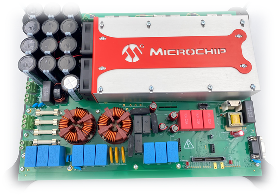
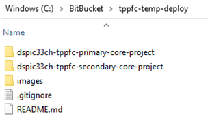
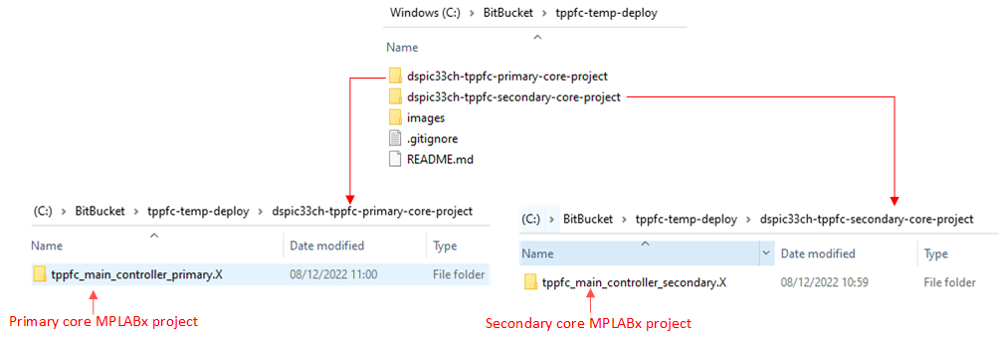
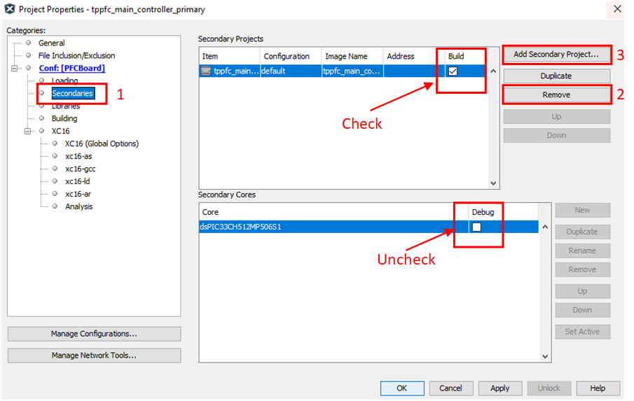

---

# dsPIC33C Totem Pole PFC Development Platform

### dsPIC33CH Primary and Secondary Core Firmware 

<a target="_blank" href="" rel="nofollow">
dsPIC33C Totem Pole PFC Development Board
</a>

---

## Summary

The dsPIC33C Totem Pole Power Factor Correction (PFC) platform, based on Microchips dsPIC33C and Silicon Carbide (SiC) devices, supports rapid prototyping and code development. The primary target application is automotive On-board chargers (OBC), but it can be used for any other industrial or telecom application that requires high power PFC.  

The PFC can be controlled by a dual core dsPIC (dsPIC33CH512MP506). This readme gives an overview of the firmware running on this device. Note that there are two MPLABx projects associated with this deployment, one for the primary core and one for the secondary core.

[[back to top](#start-doc)]
- - -

## Highlights

- Control 3 phases at 100kHz Fsw
- Supports the following operating modes at both low voltage and high voltage
  - Single and three phase PFC
  - Single phase PFC with two legs interleaved
  - Single and three phase current (grid-tied) inverter
  - Single and three phase voltage inverter
  - Forward operation, current mode
- CAN communication to PC running Power Board Visualizer GUI
- SPI communication to Isolated Voltage Acquisition Board
- I2C communication to PIC16 on main power board (for housekeeping)

For PFC operation, the input voltage can be AC or DC.
  

[[back to top](#start-doc)]

- - -

## Related Documentation

__Firmware documentation__

- TBD

__Hardware Documentation__

- dsPIC33C Totem Pole PFC Development Board User's Guide
- Isolated VoltageAcquisition Board User’s Guide
- SiC FET Plug-In Module (SiC FET PIM) User’s Guide

__Target Device Documentation__

- [dsPIC33CH512MP506 Family Data Sheet](https://www.microchip.com/en-us/product/dsPIC33CH512MP506)
- [dsPIC33CH512MP506 Family Silicon Errata and Data Sheet Clarification](https://ww1.microchip.com/downloads/en/DeviceDoc/dsPIC33CH512MP508-Family-Silicon-Errata-and-Data-Sheet-Clarification-DS80000805K.pdf)

__Please always check for the latest data sheets on the respective product websites:__

- [dsPIC33CH512MP508 Family](https://www.microchip.com/dsPIC33CH512MP508)

[[back to top](#start-doc)]

- - -

## Software Used

- [MPLAB&reg; X IDE v6.0](https://www.microchip.com/mplabx-ide-windows-installer)
- [MPLAB&reg; XC16 Compiler v1.70](https://www.microchip.com/en-us/tools-resources/archives/mplab-ecosystem)
- [Microchip Code Configurator v5.1.7](https://www.microchip.com/mplab/mplab-code-configurator)
- [MPLAB® PowerSmart™ Development Suite](https://www.microchip.com/en-us/solutions/power-management-and-conversion/intelligent-power/mplab-powersmart-development-suite)
- [Digital Compensator Design Tool](https://www.microchip.com/developmenttools/ProductDetails/DCDT)

## Hardware Used

- dsPIC33C Totem Pole PFC Development Platform
  - Power Board
  - Isolated Voltage Acquisition Board
  - SiC FET PIM

[[back to top](#start-doc)]

- - -

## MPLABx Project Setup Guide

Both the dsPIC33CH primary and secondary core projects are required.
If you use the default directory structure, you can ignore this section.

__Relative locations of primary and secondary core projects__

The user can place both the primary core and secondary core MPLABx projects in whatever location they desire.

However, if you follow the structure proposed in this section, you will not need to change the project settings for the primary core project.

If you follow our scheme, what is important is the relative locations of the primary and secondary core projects. In some root folder, which is named "tppfc-temp-deploy" below, create one folder for the primary core project, and one for the secondary core project.

  

    
     
    Directory structure for primary and secondary core projects on PC
  

Place the primary core project in one directory and the secondary in the other, as shown below.

  

     
     
    Place primary core and secondary core projects in sub-folders under a "root" directory
  

Out of the box, the primary core project is linked to the secondary core project, if the relative location on both projects is as shown above.

If you wish to place the secondary core project in a different location, this is also okay; you just need to change the settings in the primary core MPLABx project. Open the primary project properties (right click on the project name in the project explorer, left click "properties"), open the "Secondaries" menu. See below for more details.

  

     
     
    Add secondary project to primary core project
  

__Compiler Version__

Please use xc16 compiler version 1.70 for the primary and secondary core projects.
Older versions of the xc16 compiler can be found here: [MPLAB Ecosystem Archives.](https://www.microchip.com/en-us/tools-resources/archives/mplab-ecosystem)

[[back to top](#start-doc)]

- - -

## Firmware Overview

See below for a top-level overview of the firmware running on each microcontroller on this development platform. More to follow on this...

  

     
     
    Overview of microcontrollers in the system
  

[[back to top](#start-doc)]

- - -

&copy; 2022, Microchip Technology Inc.
